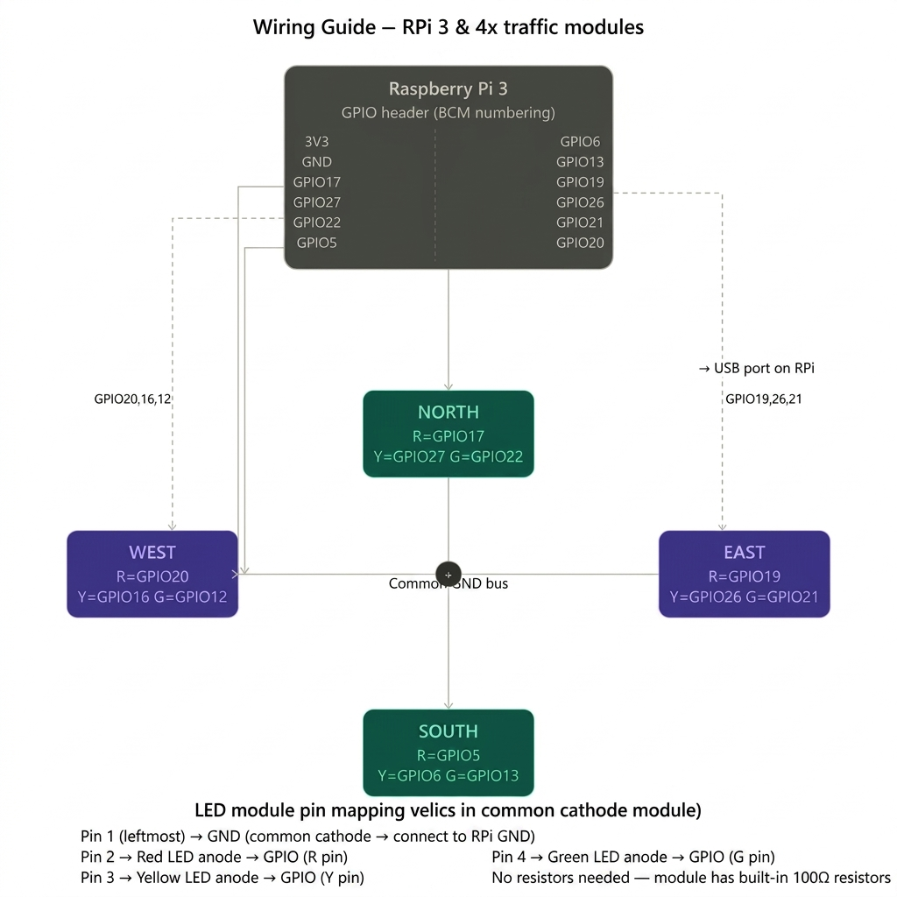
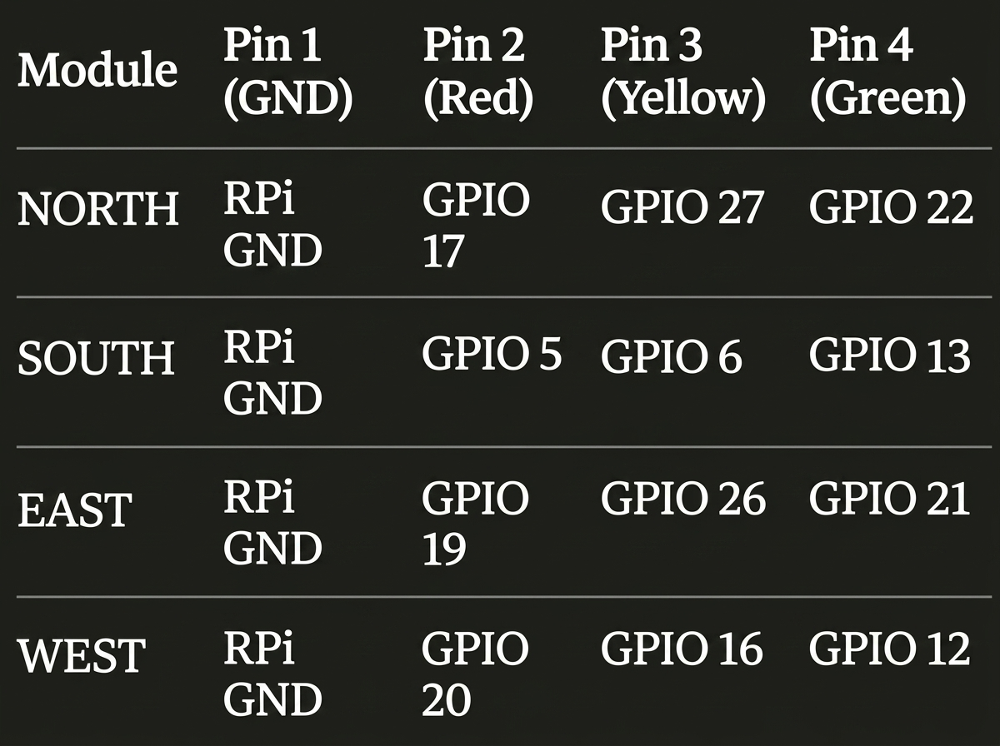

<div align="center">

## 📸 Project Gallery

<table>
  <tr>
    <td align="center">
      
      <br><sub><b>IoT Model — 4-Way Intersection (Top View)</b></sub>
    </td>
    <td align="center">
      
      <br><sub><b>Software — Live AI Dashboard (4 Lanes)</b></sub>
    </td>
  </tr>
  <tr>
    <td align="center">
      
      <br><sub><b>IoT Model — Full Intersection with Sensors</b></sub>
    </td>
    <td align="center">
      
      <br><sub><b>Software — Raspberry Pi Live Control Dashboard</b></sub>
    </td>
  </tr>
  <tr>
    <td align="center">
      
      <br><sub><b>IoT Model — LED Signal Close-Up (Night Test)</b></sub>
    </td>
    <td align="center">
      
      <br><sub><b>IoT Model — Signal Tower (Lab Demo)</b></sub>
    </td>
  </tr>
</table>


---

## 📋 Overview

**AI-UTMS** solves a critical real-world urban problem: conventional fixed-timer traffic signals cause unnecessary congestion, delay emergency response, and ignore real-time conditions like weather or pedestrian safety.

This system uses a **Deep Q-Network (DQN) Reinforcement Learning agent** trained on an 18-dimensional state space to make adaptive, real-time signal decisions. Simultaneously, a **YOLOv8 Computer Vision pipeline** provides live vehicle detection, ambulance identification, and pedestrian recognition across all 4 lanes.

The complete system runs on a **Flask web dashboard** for simulation-based demonstration, and is also physically implemented on a **Raspberry Pi 4** with real IR sensors, RGB LEDs, and a USB camera — bridging AI research with real embedded hardware.

### Why this approach is different

| Traditional Fixed Timers               | AI-UTMS (RL + CV)                                                 |
| -------------------------------------- | ----------------------------------------------------------------- |
| Fixed green time regardless of traffic | Adaptive green time based on real-time density                    |
| No emergency vehicle awareness         | YOLOv8 detects ambulances at ≥70% confidence → instant override |
| No weather consideration               | Weather factor adjusts green duration (rain/fog +40%)             |
| Starvation of low-traffic lanes        | Cycle guard prevents any lane from waiting > 4 cycles             |
| No pedestrian integration              | Pedestrian detection triggers safety extension                    |

---

## ✨ Features

### 🧠 Intelligence Core

- **DQN Reinforcement Learning** — 18-dim state vector with 5 decision modes: exploit, explore, ambulance, pedestrian, starvation guard.
- **YOLOv8 Computer Vision** — Real-time vehicle detection (car, bus, truck, motorcycle, ambulance, pedestrian) across 4 live video lanes.
- **Emergency Vehicle Priority** — Custom-trained emergency model detects ambulances/police/fire at ≥70% confidence; immediately grants green for 15s.
- **Weather-Aware Control** — Integrates with Open-Meteo API; extends green time during rain (+40%) and fog.
- **Starvation Prevention** — Fairness guard ensures no lane waits more than 4 consecutive cycles.

### 📊 Web Dashboard (Flask)

- 🎨 **Premium Dark UI** — Enterprise-grade dark theme with gradient accents and micro-animations.
- 📤 **Live 4-Lane Feed** — Real-time YOLOv8 vehicle detection with bounding boxes per lane.
- 📈 **RL Monitor** — Live DQN training charts: reward curve, ε-decay, loss over episodes.
- 📊 **Analysis Page** — Cumulative stats, decision-mode donut chart, vehicle type breakdown.
- 🚀 **Simulation Mode** — Offline fallback without real camera feeds.

### 🔌 Hardware (Raspberry Pi IoT)

- Physical 4-way road intersection model with RGB LED traffic signals.
- IR proximity sensors per lane for real density detection.
- USB camera for live ambulance detection inference.
- Weather-aware phase adjustment via Open-Meteo API.
- Real-time power consumption monitoring.

---

## 🏗️ Project Structure

```
AI-based-Urban-Traffic-Management-System/
│
├── itms_rl/                          # SOFTWARE — Flask Web Application
│   ├── app.py                        # Main Flask routes and server
│   ├── detector.py                   # YOLOv8 detector + simulation fallback
│   ├── traffic_logic.py              # RL-driven signal controller (threading)
│   ├── train_emergency_model.py      # Emergency vehicle model trainer
│   ├── validate_emergency_dataset.py # Dataset validator
│   ├── requirements.txt              # Python dependencies
│   ├── README.md                     # Software-specific setup guide
│   ├── project_phases.json           # Timeline config
│   ├── emergency_dataset.yaml        # Emergency model dataset config
│   ├── yolov8n.pt / yolov8s.pt       # YOLOv8 pretrained weights
│   ├── rl_agent/
│   │   └── dqn_agent.py              # DQN agent (TensorFlow 2.x)
│   ├── models/
│   │   └── dqn_traffic.weights.h5    # Trained RL weights (auto-created)
│   ├── templates/                    # HTML pages
│   │   ├── login.html / signup.html
│   │   ├── project_home.html         # Main project overview page
│   │   ├── dashboard.html            # Live 4-lane feed + signals
│   │   ├── rl_monitor.html           # DQN training charts
│   │   ├── analysis.html             # Stats + decision mode donut
│   │   └── upload.html               # Video upload page
│   └── uploads/                      # Uploaded lane video files
│
├── 02_HARDWARE_IOT/                  # HARDWARE — Raspberry Pi / Embedded IoT
│   ├── firmware/
│   │   ├── traffic_final.py          # Full RPi system (weather + emergency)
│   │   └── traffic_system.py         # RL Q-learning GPIO controller
│   ├── project_images/               # Hardware demo photos (processed)
│   │   ├── hardware_01_iot_model_overhead_closeup.jpg
│   │   ├── hardware_02_iot_model_top_view_with_cars.jpg
│   │   ├── hardware_03_iot_side_lab_view.jpg
│   │   ├── hardware_04_iot_full_intersection_top.jpg
│   │   ├── hardware_05_gpio_wiring_diagram.jpg
│   │   └── hardware_06_gpio_pin_table.jpg
│   └── README_HARDWARE.md            # GPIO wiring, component list
│
└── 03_DOCS/                          # DOCUMENTATION
    ├── reports/
    │   ├── abstract.pdf
    │   ├── interim_report_final.pdf
    │   └── research_paper_ai_traffic_management.pdf
    ├── presentations/
    │   └── review_2_presentation.pdf
    └── media/
        ├── screenshots/              # Software UI screenshots
        └── demo_videos/              # Traffic simulation videos
```

---

## 🛠️ Tech Stack

| Category                  | Technology             | Purpose                                    |
| ------------------------- | ---------------------- | ------------------------------------------ |
| **Web Framework**   | Flask 3.x              | Backend server and routing                 |
| **Computer Vision** | YOLOv8 (Ultralytics)   | Real-time vehicle and pedestrian detection |
| **RL Framework**    | TensorFlow 2.x / Keras | DQN agent training and inference           |
| **Frontend**        | HTML5 + Vanilla CSS    | Premium dark UI dashboard                  |
| **Database**        | SQLite                 | Traffic log, user management               |
| **Embeddings**      | OpenCV                 | Video frame processing                     |
| **IoT Hardware**    | Raspberry Pi 4         | Edge inference and GPIO control            |
| **Weather API**     | Open-Meteo             | Real-time weather-aware phase adjustment   |
| **Auth**            | Werkzeug (bcrypt)      | Secure login / session management          |

---

## 🤖 Architecture: 7-Stage RL Pipeline

```
Live Video Feed (4 Lanes)
        │
        ▼
1. YOLOv8 Detector
   (Counts vehicles, detects ambulance/pedestrian per lane)
        │
        ▼
2. State Vector Construction (18-dim)
   [densities × 4] + [wait times × 4] + [ambulance flags × 4]
   + [pedestrian flags × 4] + [weather factor] + [current phase]
        │
        ▼
3. DQN Agent Decision
   (Exploit / Explore / Emergency Override / Pedestrian Safety / Starvation Guard)
        │
        ▼
4. Signal Controller
   (Sets GREEN for selected lane, RED for all others)
        │
        ▼
5. Green Time Calculator
   (Base time + weather modifier + emergency extension)
        │
        ▼
6. Reward Computation
   wait_delta×2 + 20 (ambulance) + 5 (pedestrian) + 3 (starvation) − 0.1×density
        │
        ▼
7. Experience Replay & DQN Update
   (Replay buffer → target network → ε-decay)
```

---

## 🧠 RL State Vector (18-Dimensional)

| Indices     | Feature          | Description                               |
| ----------- | ---------------- | ----------------------------------------- |
| `[0:4]`   | Lane Densities   | Normalized vehicle count per lane         |
| `[4:8]`   | Wait Times       | Normalized cumulative wait time per lane  |
| `[8:12]`  | Ambulance Flags  | Binary: ambulance detected in lane (0/1)  |
| `[12:16]` | Pedestrian Flags | Binary: pedestrian detected in lane (0/1) |
| `[16]`    | Weather Factor   | 0=clear, 0.5=rain, 1.0=fog                |
| `[17]`    | Current Phase    | Active green lane (0–3, normalized)      |

---

## 🔌 Hardware / IoT

### GPIO Wiring Diagram

<div align="center">
  
  <br><sub><b>Raspberry Pi 3 GPIO → 4-Lane Traffic Signal Wiring</b></sub>
</div>

### Pin Mapping Table

<div align="center">
  
  <br><sub><b>LED Module GPIO Pin Assignments</b></sub>
</div>

### Components

| Component                      | Qty | Purpose                                |
| ------------------------------ | --- | -------------------------------------- |
| Raspberry Pi 4 Model B (4GB)   | 1   | Main edge computing controller         |
| RGB LED Modules (R/Y/G)        | 12  | Traffic signal simulation (3 per lane) |
| IR Proximity Sensors (FC-51)   | 4   | Lane vehicle density detection         |
| USB Camera / Pi Camera         | 1   | Live ambulance detection               |
| Breadboard + Jumper Wires      | —  | Circuit prototyping                    |
| Black foam board + chart paper | —  | Road intersection model                |
| Toy Cars                       | 8+  | Traffic simulation                     |

### Running on Raspberry Pi

```bash
cd 02_HARDWARE_IOT/firmware
pip install flask requests RPi.GPIO ultralytics opencv-python-headless
python traffic_final.py
# Dashboard: http://<raspberry-pi-ip>:5000
```

---

## 🚀 Installation (Software)

### Prerequisites

- **Python** 3.10+
- **Git**

### Step 1: Clone the Repository

```bash
git clone https://github.com/AmitC04/AI-based-Urban-Traffic-Management-System-using-Reinforcement-Learning-and-Computer-Vision.git
cd AI-based-Urban-Traffic-Management-System-using-Reinforcement-Learning-and-Computer-Vision/itms_rl
```

### Step 2: Set Up Virtual Environment

```bash
python -m venv venv

# Windows
venv\Scripts\activate

# Mac / Linux
source venv/bin/activate

pip install -r requirements.txt
```

> **TensorFlow is optional** — if not installed, the agent falls back to rule-based logic and all other features still work.

### Step 3: Launch the Dashboard

```bash
python app.py
# Navigate to: http://127.0.0.1:5000
```

On first run, go to `/signup` to create your account — the first account automatically becomes admin.

---

## 📖 Usage

### Web Dashboard

| Route           | Description                                              |
| --------------- | -------------------------------------------------------- |
| `/`           | Login page                                               |
| `/signup`     | Create account (first = admin)                           |
| `/home`       | Project intro, features, and timeline                    |
| `/upload`     | Upload lane videos or enable simulation mode             |
| `/dashboard`  | Live 4-lane feed + signals + RL status + weather         |
| `/rl_monitor` | DQN training charts — reward, ε-decay, loss            |
| `/analysis`   | Cumulative stats, decision-mode donut, vehicle breakdown |

### Simulation Mode

No camera? Enable **Simulation Mode** on the Upload page to run the full RL pipeline with pre-loaded demo videos.

### Emergency Model

Train a custom emergency vehicle detector:

```bash
# Validate dataset
python validate_emergency_dataset.py --data emergency_dataset.yaml

# Train (120 epochs, 960px)
python train_emergency_model.py --data emergency_dataset.yaml --epochs 120 --imgsz 960
# Output: models/emergency_best.pt (auto-detected by app)
```

---

## 📊 System Performance

| Metric                                   | Value                                                         |
| ---------------------------------------- | ------------------------------------------------------------- |
| **Emergency Detection Confidence** | ≥ 70% (custom model)                                         |
| **RL Decision Modes**              | 5 (exploit, explore, ambulance, pedestrian, starvation guard) |
| **State Vector Dimensions**        | 18                                                            |
| **Supported Vehicle Classes**      | Car, Bus, Truck, Motorcycle, Ambulance, Police, Fire          |
| **Weather Modifiers**              | Clear (1.0×), Rain (+40%), Fog (+60%)                        |
| **Starvation Guard Threshold**     | 4 consecutive skips                                           |
| **Green Time Range**               | Dynamic (base + modifiers)                                    |

---

## 🗂️ Configuration

All runtime settings are controlled via `project_phases.json` (timeline) and in-dashboard controls:

| Control               | Options                                         | Recommended     |
| --------------------- | ----------------------------------------------- | --------------- |
| Emergency Policy      | `custom_only`, `hybrid`, `heuristic_only` | `custom_only` |
| Emergency Min Conf    | 0.30 – 0.95                                    | `0.70`        |
| Emergency Sensitivity | `strict`, `moderate`, `loose`             | `strict`      |

---

## 🐛 Troubleshooting

**TensorFlow not detected**

```bash
pip install tensorflow>=2.13.0
# If on Windows, GPU not supported natively — use CPU or WSL2
```

**YOLOv8 CUDA out of memory**

```bash
# Switch to the nano model in detector.py
model_path = "yolov8n.pt"  # instead of yolov8s.pt
```

**Emergency model not found**

```
Place best.pt in the project root, or upload via the Upload page
App auto-falls back to heuristic detection if no model is found
```

---

## 👨‍💻 Project Team

**Minor Project — SRM Institute of Science & Technology**
Dept. of Electronics and Communication Engineering

| Name                   | Role                                     | GitHub                                          |
| ---------------------- | ---------------------------------------- | ----------------------------------------------- |
| **Amit Chauhan** | Lead Developer — RL Agent, Backend, IoT | [@AmitC04](https://github.com/AmitC04)           |
| **Lakshita**     | Hardware Integration, Dataset, Testing   | [@lakshita4816](https://github.com/lakshita4816) |

**Faculty Guide:** Dr. Bharathababu K — Dept. of ECE, SRMIST

---

## 🙏 Acknowledgments

- [Ultralytics](https://ultralytics.com/) for YOLOv8 — best-in-class real-time object detection.
- [TensorFlow / Keras](https://tensorflow.org/) for the DQN deep learning framework.
- [Open-Meteo](https://open-meteo.com/) for the free weather API.
- [Flask](https://flask.palletsprojects.com/) for the lightweight and powerful Python web framework.

---

<div align="center">
