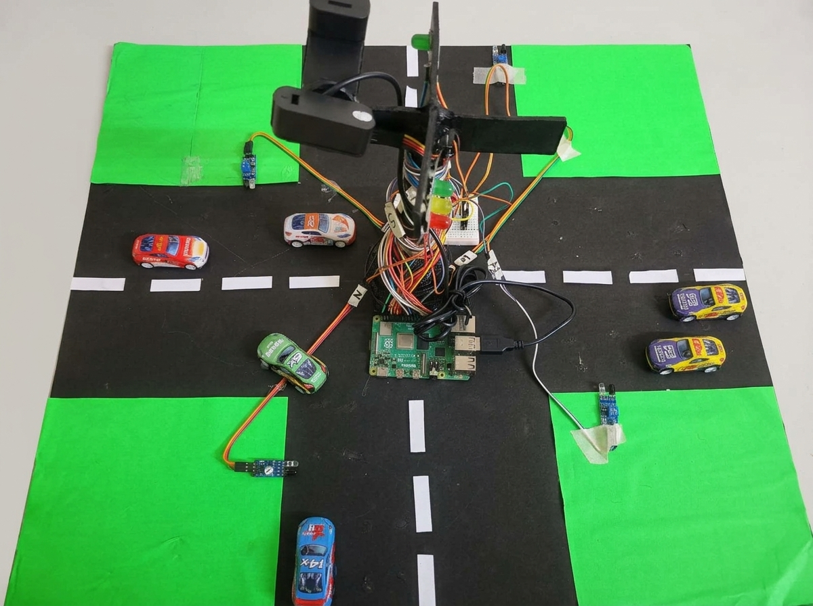
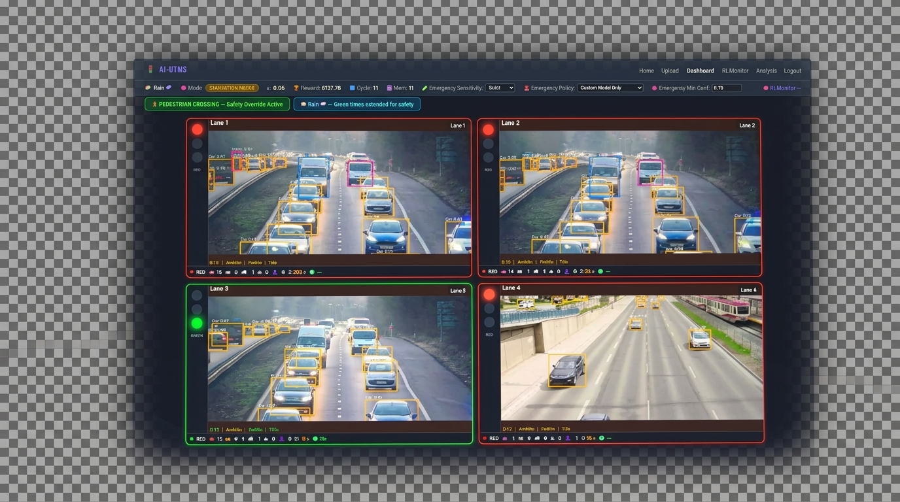
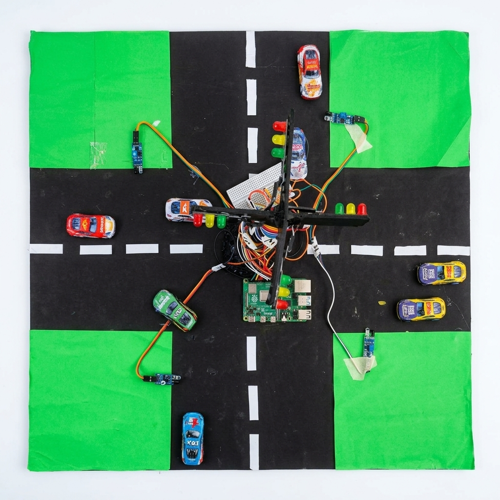
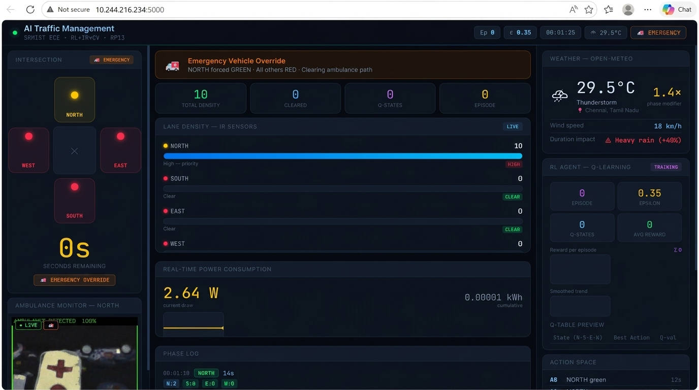
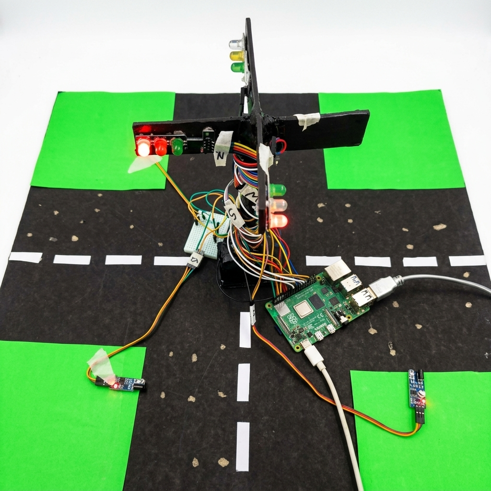
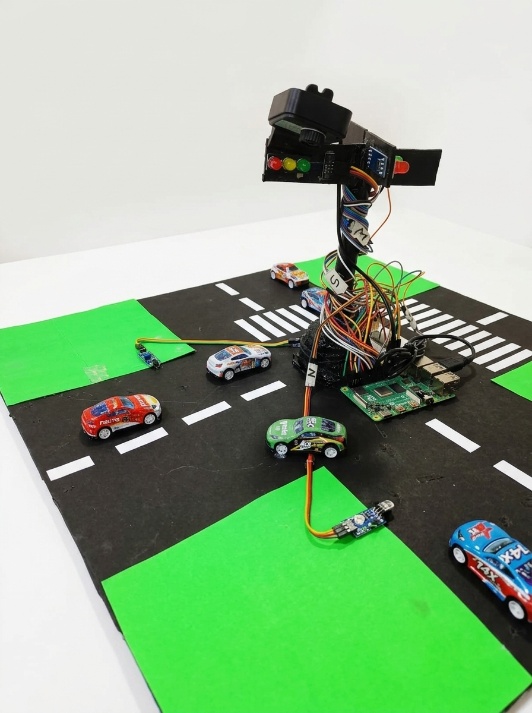

<div align="center">

# 🚦 AI-Based Urban Traffic Management System

### Reinforcement Learning + Computer Vision for Adaptive Smart City Traffic Control

[](https://python.org/)
[](https://flask.palletsprojects.com/)
[](https://ultralytics.com/)
[](https://tensorflow.org/)
[](https://raspberrypi.org/)
[](LICENSE)

> A real-time, AI-powered traffic signal controller combining **Deep Q-Network (DQN) Reinforcement Learning** and **YOLOv8 Computer Vision** to adaptively optimize urban intersection throughput, prioritize emergency vehicles, protect pedestrians, and respond to weather conditions. Deployed on both a full-stack Flask web application and a physical **Raspberry Pi IoT** model.

---

[Upgrades](#-upgrades-from-v1) • [Overview](#-overview) • [Features](#-features) • [Architecture](#-architecture) • [Hardware](#-hardware--iot) • [Installation](#-installation) • [Usage](#-usage) • [Team](#-team)

---

</div>

## 🆕 Upgrades from v1 (YOLOv8-only)

| Feature | v1 (Old) | v2 (This) |
|---------|----------|-----------|
| Signal decision | Density formula | **DQN Reinforcement Learning** |
| Pedestrian detection | ❌ | **✅ YOLOv8 (COCO class 0)** |
| Weather awareness | ❌ | **✅ Weather state + green time extension** |
| RL training monitor | ❌ | **✅ Live reward/loss/epsilon charts** |
| Decision modes | 1 | **5 (exploit, explore, ambulance, pedestrian, starvation guard)** |
| Starvation prevention | ❌ | **✅ Cycle guard after 4 skips** |
| DB logging | Basic | **+ pedestrian count + decision mode** |

---

## 📸 Project Gallery

<table>
  <tr>
    <td align="center">
      
      <br><sub><b>IoT Model — 4-Way Intersection (Top View)</b></sub>
    </td>
    <td align="center">
      
      <br><sub><b>Software — Live AI Dashboard (4 Lanes)</b></sub>
    </td>
  </tr>
  <tr>
    <td align="center">
      
      <br><sub><b>IoT Model — Full Intersection with Sensors</b></sub>
    </td>
    <td align="center">
      
      <br><sub><b>Software — Raspberry Pi Live Control Dashboard</b></sub>
    </td>
  </tr>
  <tr>
    <td align="center">
      
      <br><sub><b>IoT Model — LED Signal Close-Up (Night Test)</b></sub>
    </td>
    <td align="center">
      
      <br><sub><b>IoT Model — Signal Tower (Lab Demo)</b></sub>
    </td>
  </tr>
</table>

---

## 📋 Overview

**AI-UTMS** solves a critical real-world urban problem: conventional fixed-timer traffic signals cause unnecessary congestion, delay emergency response, and ignore real-time conditions like weather or pedestrian safety.

This system uses a **Deep Q-Network (DQN) Reinforcement Learning agent** trained on an 18-dimensional state space to make adaptive, real-time signal decisions. Simultaneously, a **YOLOv8 Computer Vision pipeline** provides live vehicle detection, ambulance identification, and pedestrian recognition across all 4 lanes.

The complete system runs on a **Flask web dashboard** for simulation-based demonstration, and is also physically implemented on a **Raspberry Pi 4** with real IR sensors, RGB LEDs, and a USB camera — bridging AI research with real embedded hardware.

---

## ✨ Features

### 🧠 Intelligence Core
- **DQN Reinforcement Learning** — 18-dim state vector with 5 decision modes.
- **YOLOv8 Computer Vision** — Real-time vehicle detection (car, bus, truck, motorcycle, ambulance, pedestrian) across 4 live video lanes.
- **Emergency Vehicle Priority** — Detects ambulances/police/fire; natively prioritized by the RL agent for massive reward (+20).
- **Weather-Aware Control** — Extends green time during rain (+40%) and fog.
- **Starvation Prevention** — Fairness guard ensures no lane waits more than 4 consecutive cycles.

### 📊 Web Dashboard (Flask)
- 🎨 **Premium Dark UI** — Enterprise-grade dark theme with gradient accents.
- 📤 **Live 4-Lane Feed** — Real-time YOLOv8 vehicle detection.
- 📈 **RL Monitor** — Live DQN training charts: reward curve, ε-decay, loss.
- 📊 **Analysis Page** — Cumulative stats, decision-mode donut chart.

### 🔌 Hardware (Raspberry Pi IoT)
- Physical 4-way road intersection model with RGB LED traffic signals.
- IR proximity sensors per lane for real density detection.
- USB camera for live emergency vehicle detection inference.

---

## 🏗️ Project Structure

```
FINAL_MAIN/
│
├── 01_SOFTWARE/                      # SOFTWARE — Flask Web Application
│   ├── app.py                        # Main Flask routes and server
│   ├── detector.py                   # YOLOv8 detector + simulation fallback
│   ├── traffic_logic.py              # RL-driven signal controller
│   ├── train_emergency.py            # Emergency vehicle model trainer
│   ├── requirements.txt              # Python dependencies
│   ├── rl_agent/                     # DQN agent (TensorFlow 2.x)
│   ├── models/                       # Trained RL weights
│   └── templates/                    # HTML pages (dashboard, RL monitor, etc.)
│
├── 02_HARDWARE_IOT/                  # HARDWARE — Raspberry Pi / Embedded IoT
│   ├── firmware/
│   │   ├── traffic_final.py          # Full RPi system (weather + emergency)
│   │   └── traffic_system.py         # RL Q-learning GPIO controller
│   ├── project_images/               # Hardware demo photos
│   └── README_HARDWARE.md            # GPIO wiring, component list
│
└── 03_DOCS/                          # DOCUMENTATION
    ├── reports/                      # Abstract, research papers, etc.
    ├── presentations/                # PPT review files
    └── media/                        # UI screenshots and demo videos
```

---

## 🛠️ Tech Stack

| Category | Technology | Purpose |
|---|---|---|
| **Web Framework** | Flask 3.x | Backend server and routing |
| **Computer Vision** | YOLOv8 (Ultralytics) | Real-time vehicle and pedestrian detection |
| **RL Framework** | TensorFlow 2.x / Keras | DQN agent training and inference |
| **Frontend** | HTML5 + Vanilla CSS | Premium dark UI dashboard |
| **Database** | SQLite | Traffic log, user management |
| **IoT Hardware** | Raspberry Pi 4 | Edge inference and GPIO control |
| **Weather API** | Open-Meteo | Real-time weather-aware phase adjustment |

---

## 🤖 Architecture: 7-Stage RL Pipeline

```
Live Video Feed (4 Lanes)
        │
        ▼
1. YOLOv8 Detector
   (Counts vehicles, detects ambulance/pedestrian per lane)
        │
        ▼
2. State Vector Construction (18-dim)
   [densities × 4] + [wait times × 4] + [ambulance flags × 4]
   + [pedestrian flags × 4] + [weather factor] + [current phase]
        │
        ▼
3. DQN Agent Decision
   (Exploit / Explore / Emergency / Pedestrian Safety / Starvation Guard)
        │
        ▼
4. Signal Controller
   (Sets GREEN for selected lane, RED for all others)
        │
        ▼
5. Green Time Calculator
   (Base time + weather modifier + emergency extension)
        │
        ▼
6. Reward Computation
   wait_delta×2 + 20 (ambulance) + 5 (pedestrian) + 3 (starvation) − 0.1×density
        │
        ▼
7. Experience Replay & DQN Update
   (Replay buffer → target network → ε-decay)
```

---

## 🧠 RL State Vector & Reward Function

### State Vector (18-Dimensional)
| Indices | Feature | Description |
|---|---|---|
| `[0:4]` | Lane Densities | Normalized vehicle count per lane |
| `[4:8]` | Wait Times | Normalized cumulative wait time per lane |
| `[8:12]` | Ambulance Flags | Binary: ambulance detected in lane (0/1) |
| `[12:16]` | Pedestrian Flags | Binary: pedestrian detected in lane (0/1) |
| `[16]` | Weather Factor | 0=clear, 0.5=rain, 1.0=fog |
| `[17]` | Current Phase | Active green lane (0–3, normalized) |

### Reward Function
```python
reward = wait_delta × 2.0         # positive if total wait decreased
       + 20 if ambulance served   # Massive priority for emergency vehicles!
       + 5  if pedestrian cleared # Pedestrian safety bonus
       + 3  if starvation relief  # Fairness guard bonus
       - 0.1 × density_served     # Small penalty for keeping dense lane green
```

---

## 🚀 Installation & Usage (Software)

### Step 1: Clone the Repository

```bash
git clone https://github.com/AmitC04/AI-based-Urban-Traffic-Management-System-using-Reinforcement-Learning-and-Computer-Vision.git
cd AI-based-Urban-Traffic-Management-System-using-Reinforcement-Learning-and-Computer-Vision
cd 01_SOFTWARE
```

### Step 2: Set Up Virtual Environment

```bash
python -m venv venv

# Windows
venv\Scripts\activate

# Mac / Linux
source venv/bin/activate

pip install -r requirements.txt
```

> **TensorFlow is optional** — if not installed, the agent falls back to rule-based logic and all other features still work.

### Step 3: Launch the Dashboard

```bash
python app.py
# Navigate to: http://127.0.0.1:5000
# Login: traffic-admin / admin123
```

---

## 👨‍💻 Project Team

**Minor Project — SRM Institute of Science & Technology**  
Dept. of Electronics and Communication Engineering

| Name | Role | GitHub |
|---|---|---|
| **Amit Chauhan** | Lead Developer — RL Agent, Backend, IoT | [@AmitC04](https://github.com/AmitC04) |
| **Lakshita** | Hardware Integration, Dataset, Testing | [@lakshita4816](https://github.com/lakshita4816) |


**Faculty Guide:** Dr. Bharathababu K — Dept. of ECE, SRMIST

---

<div align="center">
Made with ❤️ at **SRM Institute of Science & Technology**
</div>
